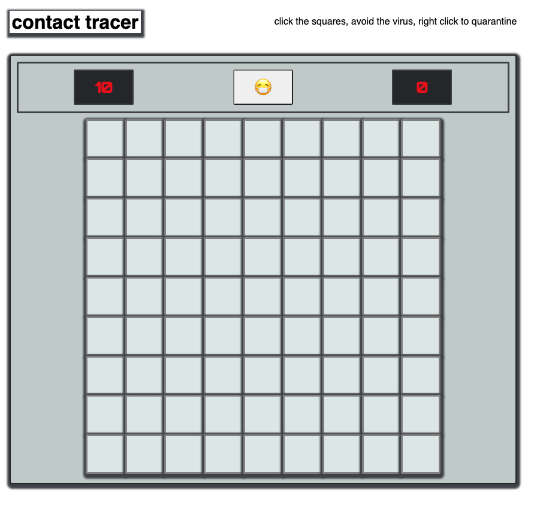
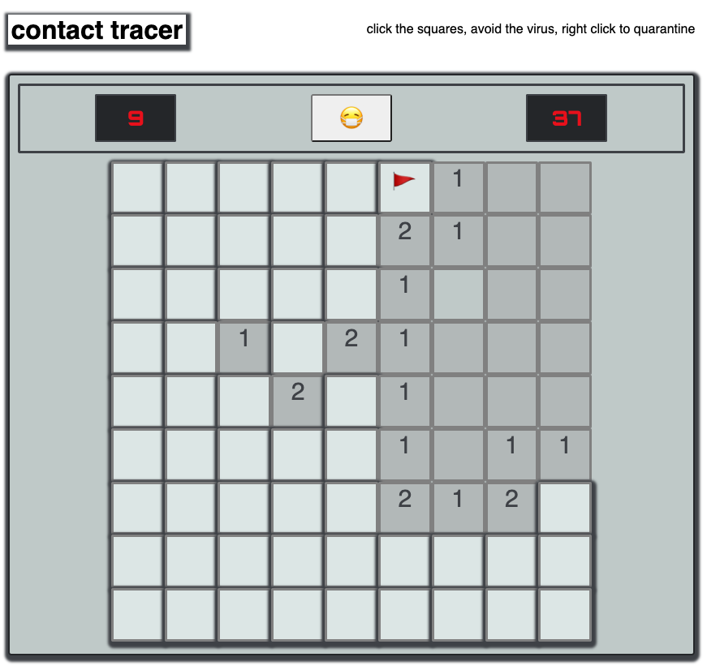
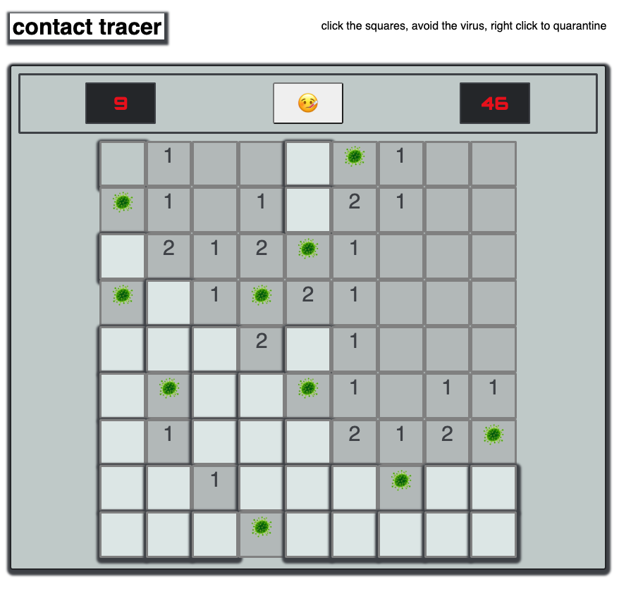
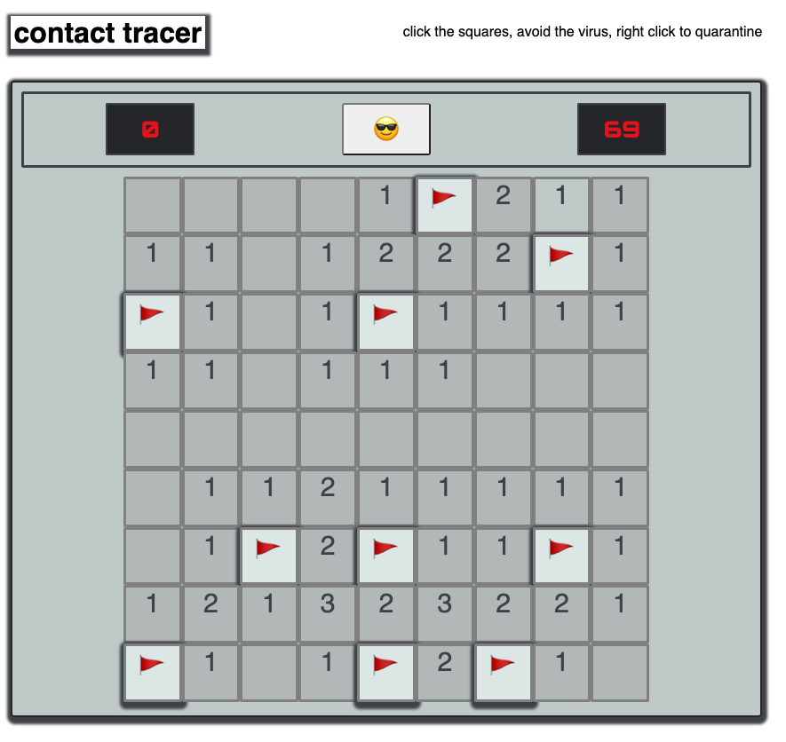

# Contact Tracer

## Intro
A game of uncovering tiles, avoiding viruses, and quarantining suspected locations. Inspired by Minesweeper.

The game is played much like Minesweeper with a few subtle thematic changes. The user is trying to avoid viruses, not bombs, and the classic 🙂 button has been replaced with a 😷  emoji, for example. The timer feature has been preserved for added stress, and for bragging rights when you finish a round quickly.

## History
Minesweeper was created by Robert Donner and Curtis Johnson in 1990 for Microsoft Windows. It was supposedly inspired by a game called Cube created by Jerimac Ratiff. Minesweeper came pre-loaded on Windows operating systems along with other favorites like Ski-Free, Solitaire, and Rodent's Revenge. 

## Screenshots

## Technologies Used
- JavaScript
- HTML
- CSS

## Getting Started

Play the game here:

If you win a round in less than 60 seconds, congratulations- you beat my high score!

Click a square to begin and start the timer. Squares display the number of adjacent tiles that are viruses. If you click on a tile that contains a virus, you lose. If you click every tile that does not have a virus, you win. You can quarantine, or flag, a tile that you think has a virus, and the counter on the upper right will update the number of virus left to discover.

If you are a mac user, you may have to use "control + click" for this feature.

## Next Steps (Ice Box 🥶)

- Replace current click function with one that recursively uncovers tiles with no surrounding virus
- Replace the current placement of virus (Math.random() based) with an algorithm that more evenly places the virus
- Add buttons for a medium and hard setting that increases the board and the number of virus
- Add a feature that displays mistakes made in quarantining (flagging) on the loss screen
- Consider a feature that would allow the user to share their fastest time on social media

