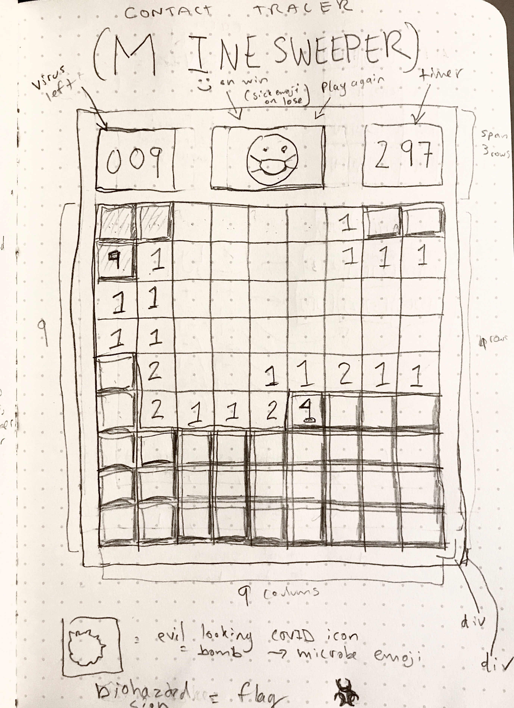

# Conctact Tracer
## Wireframes

## User Interaction

### The Board
- the user should be able to click the button on the top of the screen to start a new game

- the user should see an emoji wearing a mask on the new game button

- the user should see a 9 x 9 board of tiles when a new game starts

- the user should be able to click a tile and, on release, the tile will reveal

- the user should see either a blank space, a number, or a virus when a tile is revealed

- the user should be able to play on a board that contains 10 randomly dispersed virus

-  the user should interact with a different board every game

### Play

- the user should not be able to reveal a tile that has been quarentined

- the user should not be able to unreveal a revealed tile (click it again)

- if a virus is revealed, the user should see the game end

- if no virus is revealed, the user should see a number representing the number of adjoining tiles that contain a virus.

- if the user reveals a tile and it neither contains a virus, nor is adjacent to any viruses, it should display nothing

- if a tile is revealed and no viruses are under the tile or adjacent to the tile, the user should see every ajoining tile revealed automatically, or recursively

- the user should be able to place a biohazard sign on a tile that they believe would reveal a virus to represent that it has been quarentined

- the user should be able to remove a biohazard sign if they change their mind

- the user should see how many virus remain

- when a user places a biohazard sign, the user should see the number of remaining viruses decrease. If a biohazard sign is removed, the user should see the remaining viruses increase.

- the user should see a timer for added stress

### Winning the game

- the user should no longer be able to interact with the board by clicking

- when the user reveals all tiles that do not contain a virus, the game is over and the user has won

- the user should see an emoji with sunglasses on the new game button to indicate that the user has won

### Losing the game

- the user should no longer be able to interact with the board by clicking

- when a tile containing a virus is removed, the user has lost and should see a sick emoji on the new game button

- when a game has been lost, every virus that has not been quarentined will automatically be revealed

- if the user has quarentined a tile that does not contain a virus, they should see a red 'x' over this tile when they lose the game to indicate their mistake

- the user should see all tiles that do not contain a virus as they were during the game

- the user should see all tiles that were correctly quarentined as they were during the game

## Model Control View Organization

### Controls

### Model - State

- For each tile:
    - has it been revealed?
    - is it a virus
    - what tiles are adjacent
    - has it been quarentined?
    - how many viruses does it adjoin?

- For the game:
    - is the game over?
    - did the user win or lose?
    - how many viruses are left?
    - how many seconds have elapsed?

### View

- For each tile
    - should have a unrevealed and unrevealed styling
    - if the tile is a virus, it should display a virus emoji when revealed
    - quarentined tiles should display a biohazard symbol
    - when revealed, each tile should display a number corresponding to the number of adjacent viruses
    - if no viruses are adjacent, the tile should appear blank, but different from its unrevealed state

- For the game
    - when the user wins, the new game button should display a sunglass smiley emoji
    - when the user loser, the new game button should display a sick person emoji
    - the number of viruses left should be displayed and updated everytime a tile is quarentined
    - the number of seconds elsapsed should display during the game and should stop when the game is over

### Controller

- when the user clicks the new game button, a new game should begin
- When a new game begins, an init function should populate the state of the board
- When the user clicks and releases a tile:
    - the controller should update the model (was the game won or lost?)
    - the controller should update the view with changes indicated by the state of that tile
- when the user right clicks a tile (cntrl + click on mac):
    - the controller should update the model (tile should update to 'quarentined')
    - the controller should update the view which will indicate a new biohazard symbol has appeared
